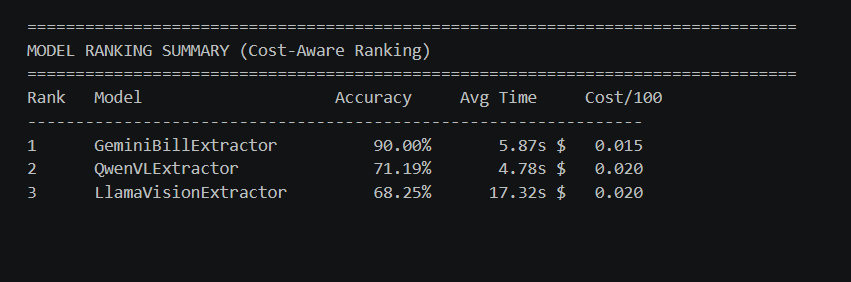
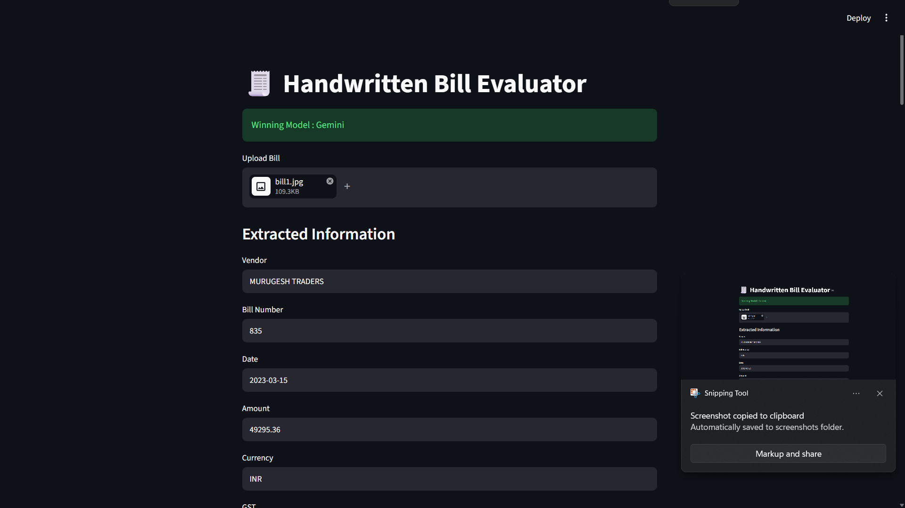
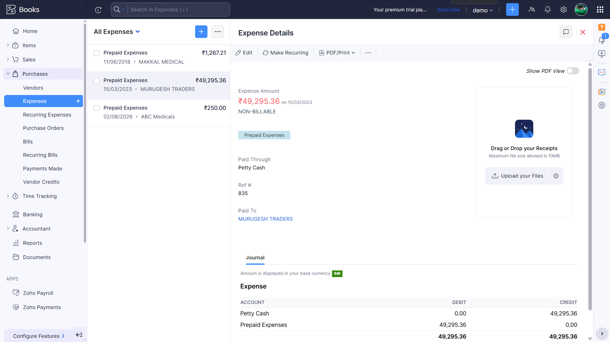

# 🧾 Handwritten Bill Evaluator

```{=html}
<p align="center">
```

**AI-powered handwritten bill extraction, Vision LLM benchmarking, and
Zoho Books automation**

**Author:** Joseph Tomy\
**Project Type:** Solo Project\
**Python:** 3.12+

```{=html}
</p>
```

---

## 📌 Overview

Handwritten Bill Evaluator is an end-to-end intelligent document
processing system that evaluates multiple Vision Large Language Models
(Vision LLMs) for handwritten bill extraction and deploys the
best-performing model in a production workflow.

The project has two distinct phases:

1.  **Evaluation Phase** -- Gemini, Qwen 2.5 VL, and Llama 3.2 Vision
    are evaluated on a labeled dataset of handwritten bills. Accuracy
    reports are generated and the best-performing model is automatically
    selected.
2.  **Production Phase** -- Users upload a handwritten bill through a
    Streamlit interface. The winning model extracts structured bill
    information, users may edit the extracted values, and the data is
    pushed into **Zoho Books** as an Expense.

Repository:

`https://github.com/joseph-tomy/handwritten-bill-evaluator`

---

# ✨ Features

- Multi-model Vision LLM evaluation
- Ground truth comparison
- Automatic winner selection (`winner.json`)
- Streamlit production interface
- Editable OCR output before submission
- Zoho Books Expense creation
- Vendor auto lookup / creation
- JSON and text evaluation reports
- Modular architecture
- Environment-based configuration

---

# 🏗 Architecture

```text
                   DATASET
                       │
       ┌───────────────┼────────────────┐
       │               │                │
       ▼               ▼                ▼
   Gemini        Qwen 2.5 VL      Llama 3.2 Vision
       │               │                │
       └───────────────┼────────────────┘
                       ▼
              Evaluation Framework
                       │
          Accuracy & Performance Reports
                       │
                 winner.json
                       │
              Production Pipeline
                       │
                Streamlit Web UI
                       │
             Upload Handwritten Bill
                       │
             Winning Vision LLM
                       │
           Structured Bill Extraction
                       │
              User Review / Edit
                       │
              Zoho Books Expense
```

---

# 📂 Project Structure

```text
handwritten-bill-evaluator/
├── dataset/
│   ├── images/
│   └── ground_truth.json
├── evaluation/
├── models/
├── reports/
├── zoho/
├── tests/
├── main.py
├── production.py
├── streamlit_app.py
├── requirements.txt
├── winner.json
├── .env.example
└── README.md
```

---

# ⚙️ Installation

```bash
git clone https://github.com/joseph-tomy/handwritten-bill-evaluator.git
cd handwritten-bill-evaluator
python -m venv .venv
```

Activate the virtual environment.

Windows

```bash
.venv\Scripts\activate
```

Install dependencies

```bash
pip install -r requirements.txt
```

---

# 🔑 Environment Variables

Create `.env` from `.env.example`

```env
GEMINI_API_KEY=your_key
OPENAI_API_KEY=your_key
OPENROUTER_API_KEY=your_key

ZOHO_CLIENT_ID=your_client_id
ZOHO_CLIENT_SECRET=your_client_secret
ZOHO_REFRESH_TOKEN=your_refresh_token
ZOHO_ORGANIZATION_ID=your_org_id
```

---

# ▶️ Evaluation

Run

```bash
python main.py
```

Generated outputs

- reports/evaluation_report.txt
- reports/evaluation_report.json
- winner.json

The production application reads `winner.json` and automatically loads
the highest-performing Vision model.

---

# 🚀 Production

Run

```bash
streamlit run streamlit_app.py
```

Workflow

1.  Upload handwritten bill.
2.  Winning model extracts structured fields.
3.  Review/edit fields.
4.  Click **Create Expense**.
5.  Expense appears inside Zoho Books.

---

# 📊 Extracted Fields

- Vendor
- Bill Number
- Date
- Amount
- Currency
- GST

---

# 📈 Technologies

Category Technology

---

Language Python 3.12+
UI Streamlit
Vision Models Gemini, Qwen 2.5 VL, Llama 3.2 Vision
Validation Pydantic
Matching RapidFuzz
API Zoho Books REST API
SDKs Google GenAI, OpenAI

---

# 📸 Screenshots

## 📊 Model Evaluation

The evaluation framework compares Gemini, Qwen 2.5 VL, and Llama 3.2 Vision on a handwritten bill dataset. The best-performing model is automatically selected and saved to `winner.json` for production use.



---

## 🧾 Bill Extraction

Users upload a handwritten bill through the Streamlit application. The winning Vision LLM extracts structured information including vendor, bill number, date, amount, currency, and GST. Users can review and edit the extracted values before submission.



---

## 💼 Zoho Books Integration

After verification, the extracted bill details are automatically converted into an Expense in Zoho Books. Vendors are created automatically if they do not already exist.



---

# 🧪 Testing

Run unit tests

```bash
python -m unittest discover -v
```

---

# 🛠 Troubleshooting

## Gemini quota exceeded

Wait until the quota resets or use another API key.

## Zoho authentication

Verify:

- Client ID
- Client Secret
- Refresh Token
- Organization ID

## Connection errors

Verify internet connectivity and DNS resolution.

---

# 🔮 Future Improvements

- Batch processing
- Docker deployment
- Confidence scores
- More accounting platforms
- Additional Vision LLMs
- PDF invoice support
- Multi-user authentication

---

# 📦 Requirements

- python-dotenv
- requests
- rapidfuzz
- google-genai
- openai
- streamlit
- Pillow
- pandas
- numpy
- scikit-learn
- pydantic

---

# 🤝 Contributing

Issues and pull requests are welcome. Please open an issue before making
significant architectural changes.

---

# 📄 License

This project is intended to be released under the MIT License.

---

# 👨‍💻 Author

**Joseph Tomy**

Solo Project

GitHub: https://github.com/joseph-tomy

---

# 🙏 Acknowledgements

- Google Gemini
- OpenAI
- OpenRouter
- Zoho Books
- Streamlit
- Python Community

---
